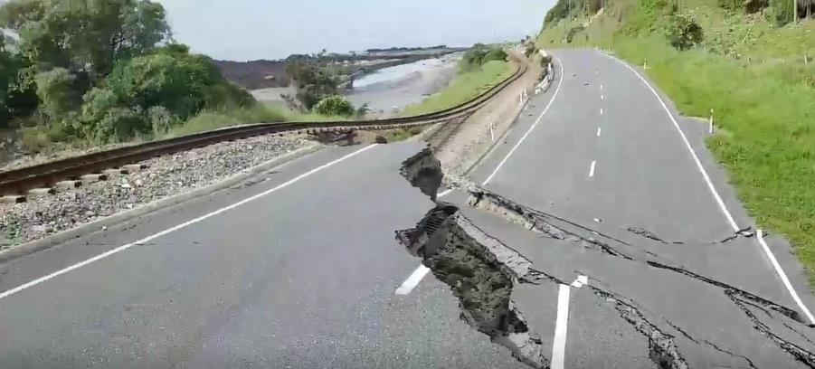

# Mapping Earthquakes with JS & APIs

## Project Overview
The purpose of this project was to visually show the differences between the magnitudes of earthquakes all over the world for the last seven days. To complete this project, I used a URL for GeoJSON earthquake data for the last seven days from the USGS website and used the JavaScript and the D3.js library to retrieve the coordinates and magnitudes of the earthquakes from the GeoJSON data. Then, I used the Leaflet library to plot the data on a Mapbox map through an API request and created interactivity for the earthquake data.

## Resources
- **Data Sources**: geoJSON files from `earthquake.usgs.gov` website 
- **Software and Tools**: JavaScript, HTML/CSS, Leaflet.js API, Mapbox API, VS Code & Git Bash

## Challenge Deliverables and Results

### Deliverable 1: Add Techtonic Plate Data
Using my knowledge of JavaScript, Leaflet.js, and geoJSON data, I added tectonic plate data using `d3.json()`, added the data using the `geoJSON()` layer, set the tectonic plate `LineString` data to stand out on the map, and added the tectonic plate data to the overlay object with the earthquake data.

### Deliverable 2: Add Major Earthquake Data
Using my knowledge of JavaScript, Leaflet.js, and geoJSON data, I added major earthquake data to the map using `d3.json()`, and a color and set the radius of the circle based on the magnitude of earthquake, and added a popup marker for each earthquake that displays the magnitude and location of the earthquake using the GeoJSON layer, `geoJSON()`.

### Deliverable 3: Add an Additional Map
Using my knowledge of JavaScript and Leaflet.js, I added a third map style to my earthquake map. I chose the dark Mapbox style, as seen below:

